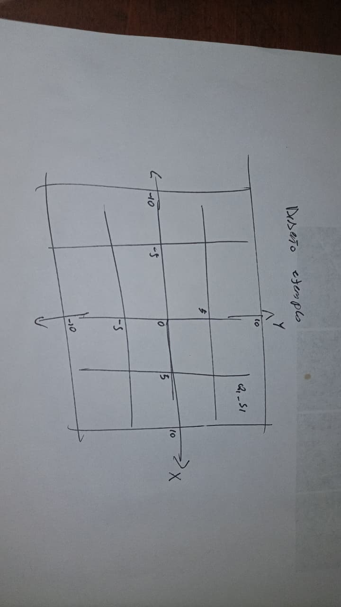
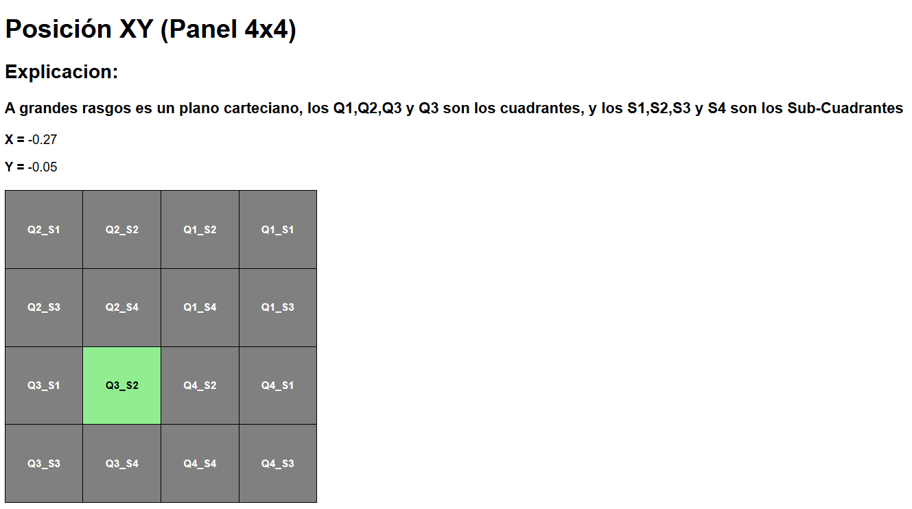

# Actividad Base: Flask + DataXY

Repositorio creado para el ramo de Desarrollo de Software para Hardware
**Desarrollado por:** Benjamín Alveal
---

## Explicación

Se expandió la interfaz de una matriz de 2x2 a una de 4x4 para representar un plano cartesiano subdividido en 4 cuadrantes principales, donde cada uno contiene 4 sub-cuadrantes. 

El código original del profesor utilizaba identificadores únicos (id) para cada cuadro; sin embargo, en el nuevo diseño se implementó una clase base junto con dos estados dinámicos (active e inactive). Esto optimizó la estructura del código, facilitando tanto su desarrollo como su posterior mantenimiento y corrección.
---
## Capturas 

A continuación se presentan las capturas correspondientes al proceso de diseño y la posterior visualización de la matriz en ejecución.

### Diseño de la Matriz

### Captura del HTML en el navegador

---

## Disculpas por faltar a clases

Profe, perdóneme por faltar 3 clases seguidas, fue por problemas de fuerza mayor...
Menos la última, a esa clase falte de flojo… pero me puse al día 😀

---

