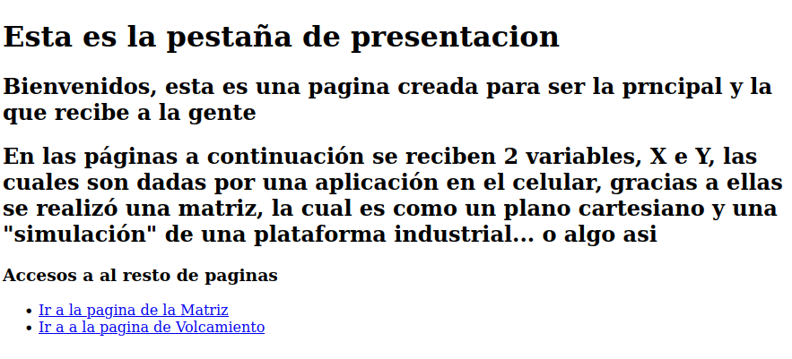
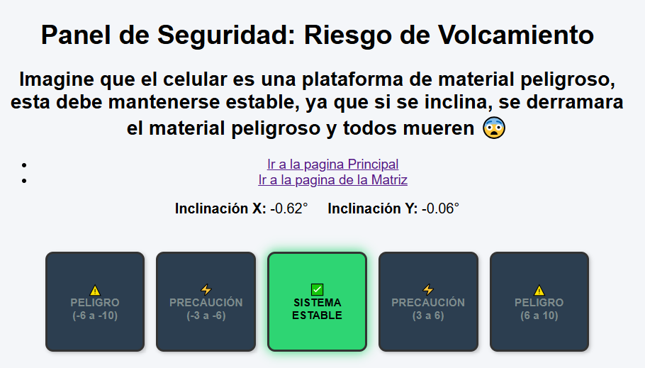

# Actividad Base: Flask + DataXY

Repositorio creado para el ramo de Desarrollo de Software para Hardware
**Desarrollado por:** Benjamín Alveal

---

## Explicación 1era pagina

Se expandió la interfaz de una matriz de 2x2 a una de 4x4 para representar un plano cartesiano subdividido en 4 cuadrantes principales, donde cada uno contiene 4 sub-cuadrantes. 

El código original del profesor utilizaba identificadores únicos (id) para cada cuadro; sin embargo, en el nuevo diseño se implementó una clase base junto con dos estados dinámicos (active e inactive). Esto optimizó la estructura del código, facilitando tanto su desarrollo como su posterior mantenimiento y corrección.

---

## Explicacion 2da pagina

Para la segunda pagina, se diseño un panel de seguridad para el monitoreo de maquinaria pesada, las cordenadas recibidas simulan la inclinacion de una plataforma.

Al igual que en la matriz, la interfaz utiliza clases y estados condicionales, esto para facilitar la legibilidad y el desarrollo del codigo.

---

## Capturas 

A continuación se presentan las capturas correspondientes al proceso de diseño y la posterior visualización de la matriz en ejecución.

### Pagina Principal

### Captura de la pestaña de la Matriz

### Captura de la pestaña de la simulacion de Volcamiento

---

## Disculpas por faltar a clases

Profe, perdóneme por faltar 3 clases seguidas, fue por problemas de fuerza mayor...
Menos la última, a esa clase falte de flojo… pero me puse al día 😀

---

